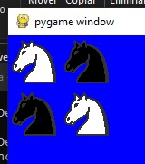
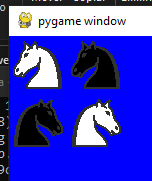
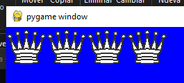
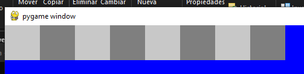
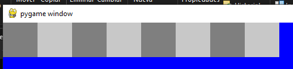
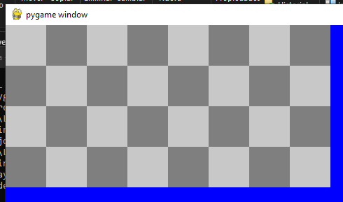
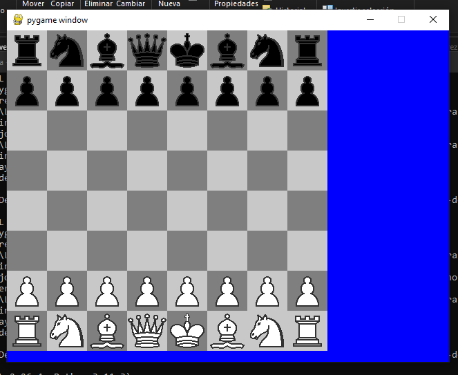

<div align="center">
<table>
    <theader>
        <tr>
            <td></td>
            <th>
                <span style="font-weight:bold;">UNIVERSIDAD NACIONAL DE SAN AGUSTIN</span><br />
                <span style="font-weight:bold;">FACULTAD DE INGENIERÍA DE PRODUCCIÓN Y SERVICIOS</span><br />
                <span style="font-weight:bold;">DEPARTAMENTO ACADÉMICO DE INGENIERÍA DE SISTEMAS E INFORMÁTICA</span><br />
                <span style="font-weight:bold;">ESCUELA PROFESIONAL DE INGENIERÍA DE SISTEMAS</span>
            </th>
            <td></td>
        </tr>
    </theader>
    <tbody>
        <tr><td colspan="3"><span style="font-weight:bold;">Formato</span>: Guía de Práctica de Laboratorio</td></tr>
        <tr><td><span style="font-weight:bold;">Aprobación</span>:  2022/03/01</td><td><span style="font-weight:bold;">Código</span>: GUIA-PRLD-001</td><td><span style="font-weight:bold;">Página</span>: 1</td></tr>
    </tbody>
</table>
</div>

<div align="center">
<span style="font-weight:bold;">GUÍA DE LABORATORIO</span><br />
</div>


<table>
<theader>
<tr><th colspan="6">INFORMACIÓN BÁSICA</th></tr>
</theader>
<tbody>
<tr><td>ASIGNATURA:</td><td colspan="5">Programación Web 2</td></tr>
<tr><td>TÍTULO DE LA PRÁCTICA:</td><td colspan="5">Python</td></tr>
<tr>
<td>NÚMERO DE PRÁCTICA:</td><td>04</td><td>AÑO LECTIVO:</td><td>2023 A</td><td>NRO. SEMESTRE:</td><td>III</td>
</tr>
<tr>
<td>FECHA INICIO:</td><td>30-May-2023</td><td>FECHA FIN:</td><td>06-Jun-2023</td><td>DURACIÓN:</td><td>04 horas</td>
</tr>
<tr><td colspan="6">RECURSOS:
    <ul>
        <li>https://www.w3schools.com/python/python_reference.asp</li>
        <li>https://docs.python.org/3/tutorial/</li>
    </ul>
</td>
</<tr>
<tr><td colspan="6">DOCENTES:
<ul>
<li>Richart Smith Escobedo Quispe - rescobedoq@unsa.edu.pe</li>
<li>Anibal Sardon </li>
</ul>
</td>
</<tr>
<tr><td colspan="6">Alumnos:
<ul>
<li>Vizcarra Gallegos Elias Eduardo - evizcarraga@unsa.edu.pe</li>
</ul>
</td>
</<tr>
</tdbody>
</table>

# Python

[![License][license]][license-file]
[![Downloads][downloads]][releases]
[![Last Commit][last-commit]][releases]

[![Debian][Debian]][debian-site]
[![Git][Git]][git-site]
[![GitHub][GitHub]][github-site]
[![Vim][Vim]][vim-site]
[![Java][Java]][java-site]

#

## OBJETIVOS TEMAS Y COMPETENCIAS

### OBJETIVOS

-   Programar usando Python.
-   Mostrar un ejemplo de separación de intereses en clases: el modelo (lista de strings) de su vista (dibujo de gráficos).

### TEMAS
-   Listas
-   Ciclos
-   Programación orientada a objetos
-   ¿Programación funcional?

<details>
<summary>COMPETENCIAS</summary>

- C.c Diseña responsablemente sistemas, componentes o procesos para satisfacer necesidades dentro de restricciones realistas: económicas, medio ambientales, sociales, políticas, éticas, de salud, de seguridad, manufacturación y sostenibilidad.
- C.m Construye responsablemente soluciones siguiendo un proceso adecuado llevando a cabo las pruebas ajustada a los recursos disponibles del cliente.
- C.p Aplica de forma flexible técnicas, métodos, principios, normas, estándares y herramientas de ingeniería necesarias para la construcción de software e implementación de sistemas de información.

</details>

## SOLUCION Y RESULTADOS

Para poder desarrollar este trabajo primero se debe entender que las imagenes de ajedrez estan compuestas por listas de strings y sabiendo esto debemos completar los metodos de picture.py, los cuales en su mayoria consisten en concatenar strings de las listas o agregar mas strings como elementos a las listas.  
El unico metodo diferente es el de negative(), cuya funcion es invertir los colores de las imagenes a partir de los caracteres que las componen y utilizando un metodo ya dado *_invColor()*:  
    ```
    def negative(self):
    """ Devuelve un negativo de la imagen """
    negative = []
    for line in self.img:
      new_line = ''
      for c in line:
        new_line += self._invColor(c)
      negative.append(new_line)
    
    return Picture(negative)
    ```

Este metodo nos permitira volver las piezas de ajedrez negras y tambien los cuadros del tablero oscuros.  
Tambien es importante saber que todos los metodos deben devolver un objeto *Picture()* en lugar de una lista para que sea posible la concatenacion de varios metodos al memento de invocar la funcion *draw()* ya que esta funcion solo debe ser invocada una ves por ejercicio.  

Con estos metodos y consideraciones podemos proceder a realizar los ejercicios:  
a) 
        ```
        draw(knight.join(knight.negative()).under(knight.negative().join(knight)))
        ```  


b) 
        ```
        draw(knight.join(knight.negative()).under(knight.join(knight.negative()).verticalMirror()))
        ```  


c) 
        ```
        draw(queen.horizontalRepeat(4))
        ```  


d) 
        ```
        draw(square.join(square.negative()).horizontalRepeat(4))
        ```  


e) 
        ```
        draw(square.join(square.negative()).horizontalRepeat(4).verticalMirror())
        ```  


f) 
        ```
        draw(square.join(square.negative()).horizontalRepeat(4).under(square.join(square.negative()).horizontalRepeat(4).verticalMirror()).verticalRepeat(2))
        ```  


g) En este ultimo ejercicio nos encontramos con un nuevo problema, ¿Como poner las piezas de ajedres encima de los cuadros del tablero si son dos imagenes diferentes?  
    Para resolver esto se creo un nuevo metodo que reemplazaba el fondo azul de las imagenes por el gris claro o blanco en el tablero:  

        ```
        def AddBackground(self):
        """Agrega fondo color LIGHTGRAY a las piezas de ajedrez"""
        backgrounded = []
        for line in self.img:
        backgrounded.append(line.replace(" ","_"))
        
        return Picture(backgrounded)
        ```

Con este nuevo metodo ya tenemos todas las herramientas necesarias para completar el ultimo ejercicio:  

        ```
        draw(rock.join(knight.AddBackground()).join(bishop).join(queen.AddBackground()).join(king).join(bishop.AddBackground()).join(knight).join(rock.AddBackground()).negative().AddBackground()
        .under(pawn.AddBackground().join(pawn).negative().AddBackground().horizontalRepeat(4))
        .under(square.join(square.negative()).horizontalRepeat(4)
                .under(square.join(square.negative()).horizontalRepeat(4).verticalMirror()).verticalRepeat(2))
                .under(pawn.join(pawn.negative().AddBackground().negative()).AddBackground().horizontalRepeat(4))
                .under(rock.negative().AddBackground().negative().join(knight).join(bishop.negative().AddBackground().negative()).join(queen).join(king.negative().AddBackground().negative()).join(bishop).join(knight.AddBackground()).join(rock).AddBackground()))
        ```  


Para que se ilustre correctamente el tablero con cuadros blancos y negros se uso el metodo *negative()* en algunas imagenes antes de agregarles el fondo que de por si es claro, mientras que a otras se uso *negative()* luego de agregar el fondo para que de esta manera el fondo tambien se invierta.  

#

## CUESTIONARIO
-   ¿Para qué sirve el directorio __pycache__?  
__pycache__ es un directorio creado por el intérprete de Python cuando importa un módulo. Este contiene el bytecode compilado del módulo, que se puede utilizar para acelerar las importaciones futuras del mismo módulo. El bytecode es específico de la versión de Python que se usó para generarlo.
Esto solo sucede cuando Python se ejecuta en una versión superior a la 3.2. 

#

## REFERENCIAS
-   https://www.w3schools.com/python/python_reference.asp
-   https://docs.python.org/3/tutorial/

#

[license]: https://img.shields.io/github/license/rescobedoq/pw2?label=rescobedoq
[license-file]: https://github.com/rescobedoq/pw2/blob/main/LICENSE

[downloads]: https://img.shields.io/github/downloads/rescobedoq/pw2/total?label=Downloads
[releases]: https://github.com/rescobedoq/pw2/releases/

[last-commit]: https://img.shields.io/github/last-commit/rescobedoq/pw2?label=Last%20Commit

[Debian]: https://img.shields.io/badge/Debian-D70A53?style=for-the-badge&logo=debian&logoColor=white
[debian-site]: https://www.debian.org/index.es.html

[Git]: https://img.shields.io/badge/git-%23F05033.svg?style=for-the-badge&logo=git&logoColor=white
[git-site]: https://git-scm.com/

[GitHub]: https://img.shields.io/badge/github-%23121011.svg?style=for-the-badge&logo=github&logoColor=white
[github-site]: https://github.com/

[Vim]: https://img.shields.io/badge/VIM-%2311AB00.svg?style=for-the-badge&logo=vim&logoColor=white
[vim-site]: https://www.vim.org/

[Java]: https://img.shields.io/badge/java-%23ED8B00.svg?style=for-the-badge&logo=java&logoColor=white
[java-site]: https://docs.oracle.com/javase/tutorial/


[![Debian][Debian]][debian-site]
[![Git][Git]][git-site]
[![GitHub][GitHub]][github-site]
[![Vim][Vim]][vim-site]
[![Java][Java]][java-site]


[![License][license]][license-file]
[![Downloads][downloads]][releases]
[![Last Commit][last-commit]][releases]
